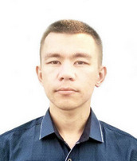

# Taysin Rinat, CV

## Summary

Fullstack / mobile developer from Russia with 5 years of professional experience. Like to solve interesting and non-standard tasks. Good-experienced in teamworkings using agile-like practices. 27 years old, located in Russia.

## Skills

### Backend development

- Enviroment: Typescript / Javascript, Node.js
- Classic solutions on Express with MongoDB
- Firebase stack (Functions / Firestore / Storage etc)
- GraphQL-based solutions with Apollo Server or Nexus / Prisma

### Frontend development

- Enviroment: Typescript / Javascript, Vue CLI / Nuxt.js (Vue 2), Vite (Vue 3)
- State management: Vuex, RxJS, Apollo, Firebase stack
- CSS framework: BootstrapVue, Buefy / Bulma

### Mobile development

- Flutter enviroment with Provider or Bloc for state management

## Career

### [Shveitsar](https://shveitsar.com/) (ex Flatsharing)
*Oct 2017 - Present, CTO*
- Architecture
- Backend, on Firebase
- Frontend of [admin](https://landlord.shveitsar.com/) and [tenant](https://tenant.shveitsar.com/) panels, on Vue CLI
- Frontend of internal simple CRM system, Vue with MongoDB Realm
- Integrations of different "smart" locks
- Leadership of small team (2 developers)

### [Municipal government institution "Center of Information Technologies"](http://it02.ru/)
*Jan 2019 - Sep 2019, Category I programmer*
- "Ufa Inspector" mobile application development, on Flutter
- Finalizing internal software's frontend, on Nuxt.js
- Refactoring internal CRM system, on C# with MS SQL

### [STC "Optimo"](http://ntc-optimo.ru/)
*Sep 2016 - Jul 2018, Leading software developer*
- ["PC Optimo"](http://ntc-optimo.ru/about/optimo-smeta) desktop application for technical calculations, on C++ using Qt 5 framework
- Developing toolchain for automating data imports from official PDF documents with technical tables, on VBA

## [SMENA](https://smena.space/)
*May 2016 - May 2016, Junior frontend developer*
- "Laborer", on ReactJS

## Education

### [USPTU](http://en.rusoil.net/)
*Sep 2011 - Jul 2015, bachelor degree*

09.03.01 - Computer Science and Engineering, Computer-Aided Software Engineering of Automated Systems program.

